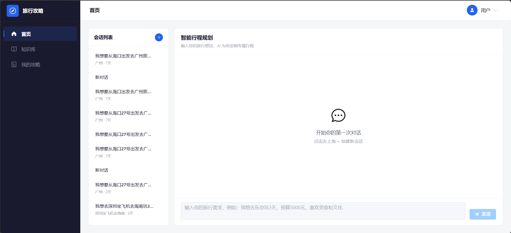
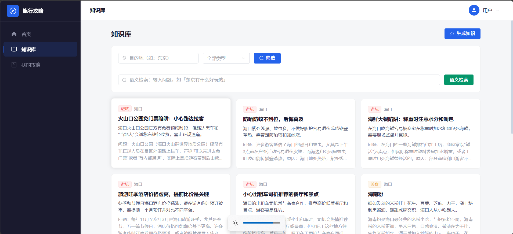
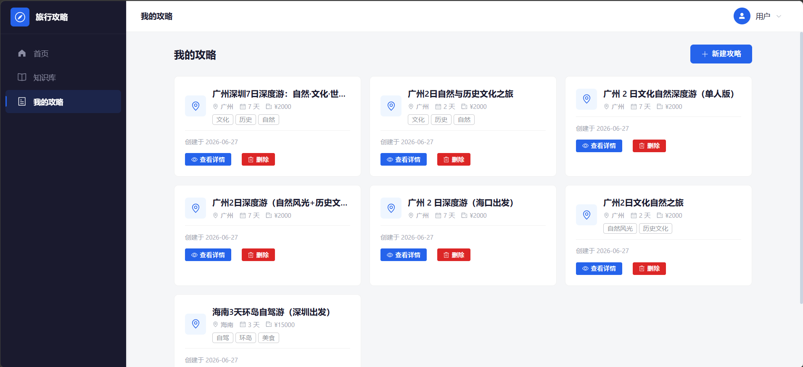
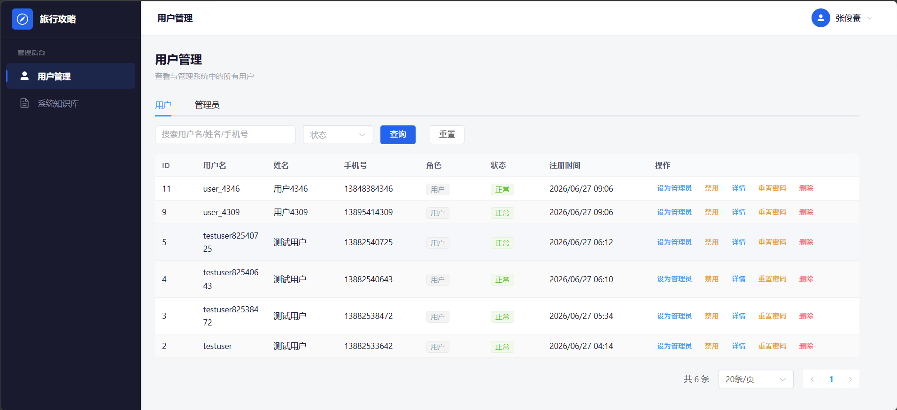
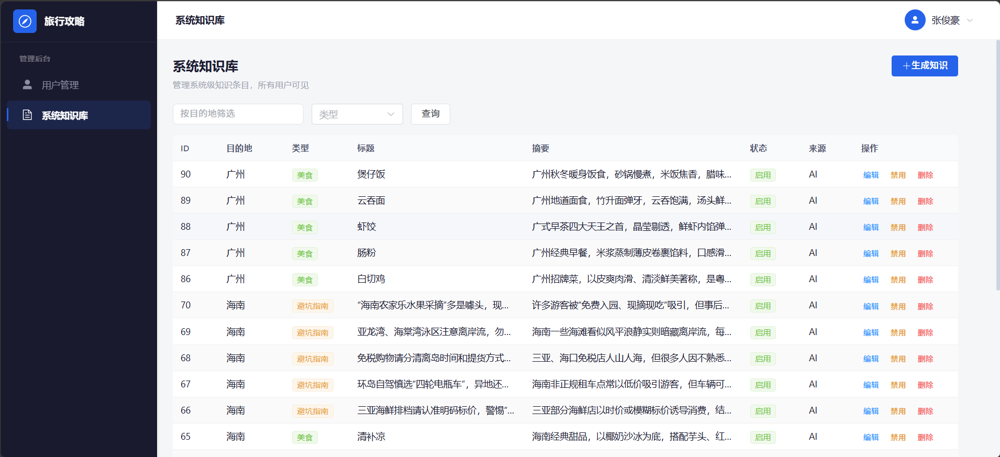

# 🧳 Travel Guide — AI 旅游攻略助手

基于 **大语言模型（LLM）+ 检索增强生成（RAG）** 的对话式旅游规划应用。用户只需以自然语言描述出行需求，AI 即可实时生成包含多天行程、景点推荐、餐饮建议和行李清单的结构化旅行计划。

> 后端：FastAPI + SQLModel + PostgreSQL/pgvector  
> 前端：Vue 3 + Element Plus + Pinia  
> AI：DeepSeek API + SiliconFlow Embedding

---

## 🖼️ 功能预览

### 💬 对话式规划

用户通过与 AI 自然对话，即可获得完整的旅行路线、景点推荐和行程安排。



### 📚 知识库检索

支持语义搜索的知识库，按目的地、类型筛选，也可由 AI 自动生成知识条目。



### 🗺️ 行程详情

自动解析 AI 回复中的结构化行程，按天展示早 / 中 / 晚安排，附带行李清单。



### 👑 管理后台 — 用户管理

支持角色分配、启用/禁用、密码重置、删除用户等操作。



### 📋 管理后台 — 知识库管理

管理系统级知识条目，支持 AI 批量生成、编辑与上下架。



---

## 🛠️ 技术栈

### 后端（FastAPIDemo/）

| 类别 | 技术 | 用途 |
|------|------|------|
| 框架 | [FastAPI](https://fastapi.tiangolo.com/) | 高性能异步 Web 框架 |
| ORM | [SQLModel](https://sqlmodel.tiangolo.com/) | 基于 Pydantic + SQLAlchemy 的类型安全 ORM |
| 数据库 | [PostgreSQL](https://www.postgresql.org/) + [pgvector](https://github.com/pgvector/pgvector) | 关系数据 + 向量相似度检索 |
| 迁移 | [Alembic](https://alembic.sqlalchemy.org/) | 数据库版本管理 |
| 认证 | JWT（python-jose）+ Passlib（bcrypt） | 双 Token（access + refresh）鉴权 |
| 流式 | SSE（sse-starlette） | AI 对话流式响应 |
| AI 客户端 | httpx | 调用 LLM / Embedding API |

### 前端（frontend/）

| 类别 | 技术 | 用途 |
|------|------|------|
| 框架 | [Vue 3](https://vuejs.org/) (Composition API) | 前端 UI 框架 |
| 构建 | [Vite](https://vitejs.dev/) | 开发服务器与打包 |
| UI 库 | [Element Plus](https://element-plus.org/) | 组件库 |
| 状态管理 | [Pinia](https://pinia.vuejs.org/) | 全局状态管理 |
| 路由 | [Vue Router](https://router.vuejs.org/) | 前端路由 |
| HTTP | Axios | 与后端通信 |
| 样式 | [Tailwind CSS](https://tailwindcss.com/) | 原子化 CSS |

### AI 服务

| 服务 | 模型 | 用途 |
|------|------|------|
| DeepSeek API | deepseek-v4-flash | 对话生成、行程规划 |
| SiliconFlow API | `BAAI/bge-large-zh-v1.5` | 文本向量化（Embedding） |

---

## ✨ 核心功能

### 💬 对话式行程规划

用户通过自然语言描述出行需求（目的地、天数、预算、偏好等），AI 实时流式生成回复并自动从中提取结构化行程。

```
用户：帮我规划一个 5 天 4 晚的北京行程，预算 5000，喜欢美食和历史
AI： 好的，为您生成以下行程计划...
```

**关键技术**：
- **参数提取** — 系统自动从对话中提取 `destination`、`days`、`budget`、`preferences` 等参数
- **RAG 增强** — 每轮对话自动检索知识库中相关景点、美食、注意事项作为上下文
- **SSE 流式输出** — 前端实时逐 token 显示 AI 回复
- **行程结构化** — AI 回复中的 `<plan>...</plan>` JSON 自动解析为数据库中的 `TravelPlan` 记录
- **变更检测** — 用户修改需求时，检测是否为"重大变更"，弹出确认框（更新现有计划 / 创建新计划）

### 📚 知识库（RAG 引擎）

支持 **系统知识库**（管理员维护）和 **个人知识库**（用户自行维护）：

- **手动录入** — 填写目的地、类型（景点/美食/避坑）、标题、摘要、详细内容
- **AI 自动生成** — 指定目的地和类型，后台异步调用 LLM 批量生成知识条目
- **语义检索** — 基于 pgvector 的向量相似度搜索，为对话提供上下文增强
- **筛选过滤** — 按目的地、类型、作用域（系统/个人）浏览

### 👥 角色权限系统

| 角色 | 权限 |
|------|------|
| `user` | 对话、个人知识库、查看个人行程 |
| `admin` | 以上 + 管理用户（非 super_admin）、管理系统知识库 |
| `super_admin` | 以上 + 管理所有管理员 |

### 🗺️ 行程管理

- 自动从对话中提取并保存结构化行程
- 多天行程展示（早 / 中 / 晚分段，含活动、餐饮、交通、费用、备注）
- 行李清单（分类展示 + 温馨提示）
- 支持手动编辑、删除

---

## 🗺️ 系统架构

```
┌─────────────────────────────────────────────────┐
│                   前端 (Vue 3)                    │
│    首页对话  │  知识库  │  行程  │  管理后台     │
│         ↑ SSE 流式     ↑ REST API               │
├─────────────────────────────────────────────────┤
│                  后端 (FastAPI)                   │
│  ┌──────┐ ┌──────┐ ┌──────┐ ┌───────────┐      │
│  │ Auth │ │ Chat │ │ Know │ │ Admin     │      │
│  │ API  │ │ API  │ │ API  │ │ API       │      │
│  └──┬───┘ └──┬───┘ └──┬───┘ └──┬────────┘      │
│     │        │        │        │                │
│     └────────┴────────┴────────┴───              │
│                     │                            │
│              ┌──────┴──────┐                     │
│              │  LLM 服务   │                     │
│              │ DeepSeek    │  ◄── RAG 上下文     │
│              │ SiliconFlow │                     │
│              └──────┬──────┘                     │
│                     │                            │
│              ┌──────┴──────┐                     │
│              │  向量检索    │                     │
│              │ pgvector    │                     │
│              └──────┬──────┘                     │
│                     │                            │
│              ┌──────┴──────┐                     │
│              │ PostgreSQL  │                     │
│              │ + pgvector  │                     │
│              └─────────────┘                     │
└─────────────────────────────────────────────────┘
```

### 数据流（对话生成）

```
用户消息 → 保存到数据库 → 提取参数 → 检测变更
    → RAG 知识检索 → 组装 Prompt → 调用 LLM
    → SSE 流式输出 → 保存 AI 回复 → 解析行程
```

---

## 🚀 快速开始

### 前置条件

- Python 3.10+
- Node.js 18+
- PostgreSQL 15+（需启用 pgvector 扩展）
- 一个 DeepSeek API Key（可选，用于对话）
- 一个 SiliconFlow API Key（可选，用于 Embedding）

### 后端

```bash
# 1. 克隆仓库
git clone https://github.com/A489-create/Travel_Guide.git
cd Travel_Guide

# 2. 创建虚拟环境并安装依赖
cd FastAPIDemo
python -m venv .venv
.venv\Scripts\activate    # Windows
# source .venv/bin/activate  # Linux / macOS
pip install -r requirements.txt

# 3. 配置环境变量
cp .env.example .env
# 编辑 .env，填入数据库连接串和 API Key

# 4. 创建数据库
psql -U postgres
CREATE DATABASE travel_guide;
\q

# 5. 启用 pgvector 扩展
psql -U postgres -d travel_guide -c "CREATE EXTENSION IF NOT EXISTS vector;"

# 6. 执行数据库迁移
alembic upgrade head

# 7. 启动服务
uvicorn app.main:app --reload --port 8000
```

访问 API 文档：http://localhost:8000/docs

### 前端

```bash
# 1. 进入前端目录
cd frontend

# 2. 安装依赖
npm install

# 3. 启动开发服务器
npm run dev
```

访问前端页面：http://localhost:5173

---

## 📁 项目结构

```
Travel_Guide/
├── FastAPIDemo/                # Python 后端
│   ├── alembic/               # 数据库迁移脚本
│   │   └── versions/          # 迁移版本
│   ├── app/
│   │   ├── api/               # API 路由
│   │   │   ├── admin.py       # 管理后台接口
│   │   │   ├── auth.py        # 认证接口
│   │   │   ├── conversations.py  # 对话接口（含 SSE）
│   │   │   ├── knowledge.py   # 知识库接口
│   │   │   └── travel.py      # 行程接口
│   │   ├── core/              # 核心工具
│   │   │   ├── exceptions.py  # 全局异常处理
│   │   │   ├── response.py    # 统一响应格式
│   │   │   └── security.py    # 密码哈希 + JWT 工具
│   │   ├── models/            # SQLModel 数据模型
│   │   ├── schemas/           # Pydantic 请求/响应模型
│   │   ├── services/          # 业务逻辑层
│   │   │   └── llm/           # LLM 客户端（DeepSeek / SiliconFlow）
│   │   ├── config.py          # 配置管理（pydantic-settings）
│   │   ├── database.py        # 数据库引擎与会话
│   │   ├── dependencies.py    # FastAPI 依赖注入
│   │   └── main.py            # 应用入口
│   ├── .env.example           # 环境变量模板
│   ├── alembic.ini            # Alembic 配置
│   └── requirements.txt       # Python 依赖
│
├── frontend/                  # Vue 3 前端
│   ├── public/                # 静态资源
│   └── src/
│       ├── api/               # API 封装（Axios）
│       ├── components/        # 公共组件
│       ├── router/            # 路由配置
│       ├── stores/            # Pinia 状态管理
│       ├── views/             # 页面视图
│       │   ├── Home.vue       # 首页对话
│       │   ├── Login.vue      # 登录
│       │   ├── Register.vue   # 注册
│       │   ├── Knowledge.vue  # 知识库
│       │   ├── TravelList.vue # 行程列表
│       │   ├── TravelDetail.vue # 行程详情
│       │   ├── AdminUsers.vue # 用户管理
│       │   └── AdminKnowledge.vue # 知识库管理
│       ├── App.vue
│       ├── main.js
│       └── style.css          # 全局样式
│   ├── index.html
│   ├── vite.config.js
│   └── package.json
│
├── assets/
│   └── screenshots/           # README 功能截图（副本供 GitHub 使用）
├── .gitignore
└── README.md
```

---

## 📖 API 文档

启动后端后，自动生成交互式 API 文档：

- **Swagger UI** — http://localhost:8000/docs
- **ReDoc** — http://localhost:8000/redoc

## 🤝 贡献指南

1. Fork 本项目
2. 创建特性分支：`git checkout -b feat/your-feature`
3. 提交变更：`git commit -m "feat: add your feature"`
4. 推送分支：`git push origin feat/your-feature`
5. 提交 Pull Request

---

## 📄 版权声明

Copyright © 2026 A489-create. All rights reserved.

未经版权所有者书面许可，不得以任何形式复制、分发、修改或使用本项目的全部或部分代码。
